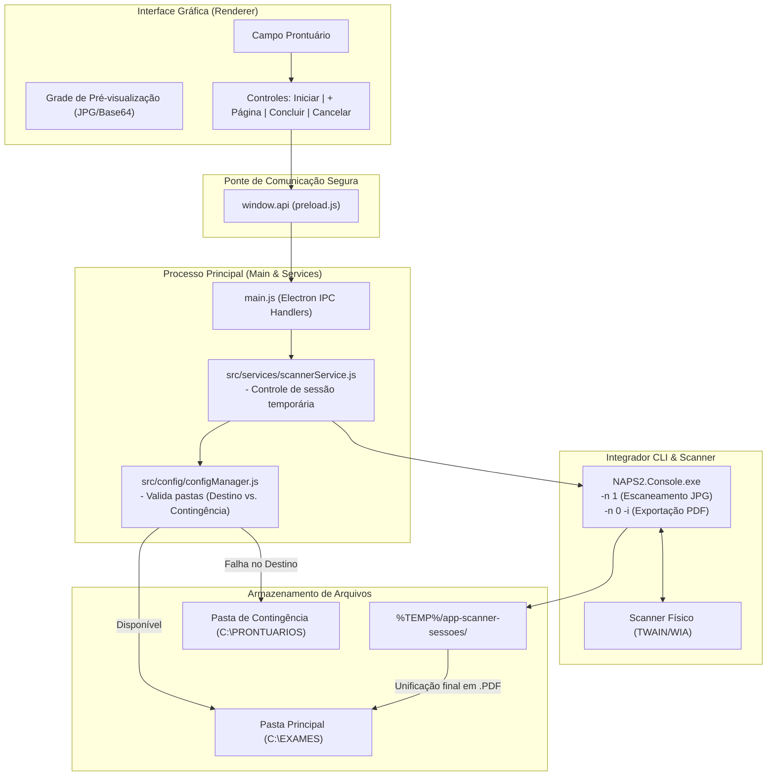

# 📑 App Scanner - Sistema de Digitalização Inteligente de Prontuários e Exames


O **App Scanner** é uma aplicação desktop médica/ambulatorial desenvolvida em **Electron** e **Node.js** para otimizar o fluxo de digitalização de prontuários, fichas e exames em lote. Através de comunicação nativa com o **NAPS2 CLI (`NAPS2.Console.exe`)**, o sistema permite capturar folhas em tempo real com pré-visualização na tela e unificá-las automaticamente em um único arquivo **PDF**, com fallback inteligente e salvamento de contingência.

---

## ✨ Principais Destaques e Funcionalidades

> [!IMPORTANT]
> O sistema foi desenhado visando **zero perda de documentos** em ambientes clínicos de alta demanda: caso a rede ou pasta principal fique indisponível, o aplicativo salva automaticamente em um caminho de contingência sem interromper o atendimento.

*   **🖥️ Digitalização em Lote Interativa (Multipáginas):**
    *   Escaneamento contínuo folha a folha dentro de uma mesma sessão de prontuário.
    *   **Grade de Visualização Dinâmica:** Exibição imediata das miniaturas das folhas digitalizadas em tempo real com número de sequência e paginação automática.
    *   **Contador de Páginas:** Badges em tempo real indicando o prontuário ativo e a contagem total de páginas anexadas.
*   **⚡ Motor NAPS2 CLI Integrado:**
    *   Integração direta com scanners TWAIN/WIA via linha de comando (`NAPS2.Console.exe`).
    *   Qualidade de compressão otimizada (`--jpegquality 85`) para imagens leves e legíveis.
    *   **Montagem Inteligente do PDF:** Unificação rápida utilizando as flags originais `-n 0 -i` para impedir acionamento acidental do alimentador do scanner durante a exportação.
*   **🛡️ Sistema de Salvamento com Contingência Automática:**
    *   Verificação de permissão e disponibilidade do diretório principal (`C:\EXAMES` por padrão).
    *   **Fallback Automático:** Caso o destino principal seja inacessível ou esteja offline, o sistema redireciona o arquivo PDF para a pasta de contingência (`C:\PRONTUARIOS`) e emite um alerta ao usuário.
*   **🧹 Gestão Inteligente de Sessão e Limpeza:**
    *   Arquivos temporários de imagem (`.jpg`) são armazenados em diretórios isolados por sessão em `%TEMP%/app-scanner-sessoes/<prontuario>/`.
    *   Limpeza automática dos arquivos temporários após a geração bem-sucedida do documento PDF ou em caso de cancelamento da sessão.
*   **🎨 Interface Moderna e Acessível:**
    *   Design baseado em *Glassmorphism* com feedback visual contínuo na barra de status.
    *   Suporte a atalhos de teclado (`Enter` no campo de prontuário para iniciar digitalização rápida).

---

## 🏛️ Arquitetura e Fluxo Operacional

O fluxo de dados segue os padrões recomendados de segurança do **Electron**, separando a interface (Renderer) do sistema operacional via ponte de contexto (`preload.js`).



---

## 📂 Estrutura de Diretórios do Projeto

```text
app-scanner/
├── config.json                     # Configuração local de diretórios, perfil e caminho do NAPS2
├── index.html                      # Layout da interface visual e grade de cards
├── main.js                         # Processo principal do Electron e registro de canais IPC
├── package.json                    # Dependências e scripts de build/execução
├── preload.js                      # Context Bridge segura de IPC (window.api)
├── renderer.js                     # Lógica da interface, eventos de clique, teclado e notificações
└── src/
    ├── config/
    │   └── configManager.js        # Carregamento de config, teste de escrita e lógica de fallback
    └── services/
        └── scannerService.js       # Orquestração de comandos do NAPS2 e gestão temporária de imagens
```

---

## ⚙️ Configuração (`config.json`)

O arquivo [config.json](file:///e:/www/scanner/app-scanner/config.json) é carregado na inicialização e permite personalizar os caminhos sem necessidade de recompilar a aplicação. 

```json
{
    "pastaDestino": "C:\\EXAMES",
    "pastaContingencia": "C:\\PRONTUARIOS",
    "caminhoNaps2": "C:\\Softwares\\NAPS2\\App\\NAPS2\\App\\NAPS2.Console.exe",
    "perfilScanner": "DS640"
}
```

### Detalhamento dos Campos
| Campo | Tipo | Padrão | Descrição |
| :--- | :--- | :--- | :--- |
| `pastaDestino` | `String` | `"C:\\EXAMES"` | Pasta primária para onde os arquivos `.pdf` consolidados serão enviados. |
| `pastaContingencia` | `String` | `"C:\\PRONTUARIOS"` | Pasta de emergência utilizada automaticamente caso a pasta destino não esteja acessível. |
| `caminhoNaps2` | `String` | `"C:\\Softwares\\NAPS2\\App\\NAPS2\\App\\NAPS2.Console.exe"` | Caminho completo do executável CLI do NAPS2. |
| `perfilScanner` | `String` | `"DS640"` | Nome exato do perfil de escaneamento configurado na interface do NAPS2. |

> [!TIP]
> Caso o arquivo `config.json` não seja encontrado na raiz do aplicativo ou pasta do executável empacotado, o sistema assume automaticamente os caminhos padrão documentados na tabela acima.

---

## 🚀 Guia de Instalação e Execução

### Pré-requisitos
1. **Node.js** (v18 ou superior).
2. **NAPS2 (Not Another PDF Scanner 2)** instalado com o executável console acessível.
3. Um **Perfil de Scanner** cadastrado e funcionando no NAPS2 (ex: `DS640`).

### Passos para Execução Local

```bash
# 1. Instalar as dependências do projeto
npm install

# 2. Iniciar a aplicação em modo de desenvolvimento
npm start
```

### Empacotamento para Produção (Instalador Windows)

```bash
# Gera o instalador NSIS (.exe) na pasta de distribuição via electron-builder
npm run build
```

---

## 📖 Guia de Uso Passo a Passo

1. **Início do Prontuário:**
   * Digite o **Número do Prontuário** no campo de texto principal.
   * Pressione <kbd>Enter</kbd> ou clique em **`Iniciar Digitalização / 1ª Página`**.
2. **Digitalização Contínua:**
   * Aguarde o scanner capturar a folha. A miniatura aparecerá automaticamente na grade central.
   * Para incluir mais folhas no mesmo documento, clique no botão **`+ Adicionar Página`**.
3. **Conclusão e Geramento do PDF:**
   * Quando todas as folhas forem escaneadas, clique em **`Concluir e Salvar PDF`**.
   * O aplicativo unificará todas as imagens, validará a pasta destino e salvará o arquivo `[PRONTUARIO].pdf`.
   * Em caso de indisponibilidade da rede, um alerta informará sobre o salvamento na pasta de contingência.
4. **Cancelamento da Sessão:**
   * Clique em **`Cancelar Sessão`** a qualquer momento para descartar as páginas escaneadas e limpar a pasta temporária.

---

## 🔧 Detalhes Técnicos e Resolução de Problemas (Troubleshooting)

### 1. Erro de Scanner sem Papel durante a Conversão em PDF (`Sem papel no alimentador`)
* **Problema:** Ao salvar o documento PDF utilizando `-i "<arquivos_jpg>" -o "<arquivo.pdf>" -f`, o NAPS2 emitia um erro e falhava com exit code `1`.
* **Causa Técnica:** O CLI do NAPS2 assume por padrão o parâmetro `-n 1` (executar uma leitura do scanner físico) sempre que o número de leituras não é especificado explicitamente.
* **Solução Implementada:** Em [scannerService.js](file:///e:/www/scanner/app-scanner/src/services/scannerService.js#L130), o comando para gerar o PDF inclui explicitamente a flag **`-n 0`**:
  ```javascript
  const cmd = `"${configuracoes.caminhoNaps2}" -n 0 -i "${listaImportacao}" -o "${arquivoSaida}" -f`;
  ```
  Isso instrui o NAPS2 a **não tentar acionar o scanner** durante a etapa de unificação de imagens.

### 2. Permissões de Pastas em Rede
* Para garantir que o salvamento em rede (ex: `\\servidor\EXAMES`) funcione adequadamente sem que o aplicativo caia em contingência, verifique se o usuário do Windows possui permissões simultâneas de leitura e escrita (`R_OK | W_OK`) no compartilhamento de rede.

---

## 🛠️ Tecnologias Utilizadas

| Tecnologia | Função no Projeto |
| :--- | :--- |
| **Electron** | Framework principal para criação da aplicação de desktop híbrida |
| **Node.js (`child_process`, `fs`, `path`)** | Orquestração de comandos do terminal, gestão de IO e manipulação de pastas |
| **HTML5 & Vanilla CSS3** | Interface de usuário moderna com suporte a responsividade e animações fluidas |
| **NAPS2 (Console CLI)** | Interface com driver de scanner (TWAIN/WIA) e motor de geração de PDFs |
| **Electron Builder** | Ferramenta de empacotamento e compilação do instalador `.exe` (NSIS) |

---

*Desenvolvido com foco em alta eficiência para atendimento ambulatorial e arquivamento clínico.*
